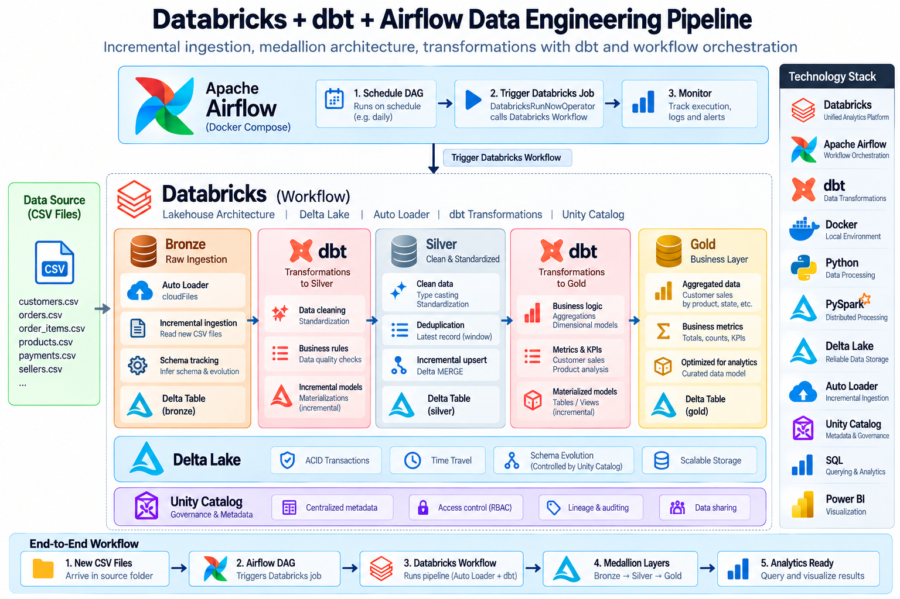

# Databricks + dbt + Airflow Data Engineering Pipeline

End-to-end data engineering project using Databricks, Delta Lake, Auto
Loader, dbt and Apache Airflow.

## Architecture



## Pipeline Overview

This project implements an end-to-end data engineering pipeline with
Databricks, Delta Lake, dbt and Apache Airflow.

### Databricks / PySpark pipeline

-   **Bronze:** Incremental CSV ingestion using Databricks Auto Loader
    with schema tracking and checkpoints.
-   **Silver:** Data cleansing, type casting, deduplication and
    incremental upserts using Delta Lake `MERGE`.
-   **Gold:** Business-level aggregations providing customer order and
    sales metrics.
-   **Orchestration:** Apache Airflow running in Docker triggers the
    Databricks Job through `DatabricksRunNowOperator`.

``` text
CSV files
   ↓
Databricks Auto Loader
   ↓
Bronze
   ↓
Silver (PySpark + Delta MERGE)
   ↓
Gold
```

### dbt transformation pipeline

dbt connects to Databricks and uses the existing Bronze orders table as
its source. Model dependencies are defined with `source()` and `ref()`,
allowing dbt to build and execute the transformation DAG automatically.

``` text
Databricks Bronze
       ↓
   stg_orders
     (view)
       ↓
  silver_orders
     (table)
       ↓
 Data Quality Tests
       ↓
 customer_sales
     (table)
```

The dbt pipeline was validated successfully with `dbt build`.

## Bronze

-   Incremental CSV ingestion using Databricks Auto Loader.
-   Schema tracking with `cloudFiles.schemaLocation`.
-   Streaming checkpoint management.
-   Delta table storage.
-   File-arrival processing using `availableNow=True`.

## Silver

### PySpark / Delta implementation

-   Data type transformations and cleansing.
-   Deduplication using window functions.
-   Incremental and idempotent upserts using Delta Lake `MERGE`.

### dbt implementation

The `silver_orders` model reads from `ref('stg_orders')`, deduplicates
orders using `row_number()`, keeps the latest record based on
`updated_at`, and is materialized as a Databricks table.

## Gold

### PySpark implementation

-   Business-level aggregations.
-   Customer order and sales metrics.

### dbt implementation

The `customer_sales` model reads from `silver_orders` using `ref()`,
filters completed orders, aggregates order count and total sales by
customer, and is materialized as a Databricks table.

## dbt

The dbt project is located under `dbt/orders_dbt/`.

The staging model `stg_orders` declares `workspace.bronze.orders` as a
dbt source.

``` text
source('bronze', 'orders')
          ↓
      stg_orders
          ↓
     silver_orders
          ↓
     customer_sales
```

### Data Quality Tests

Generic dbt tests are defined for `silver_orders`:

-   `order_id` must not be null.
-   `order_id` must be unique.
-   `customer_id` must not be null.

The complete dbt build executes 1 staging view, 2 table models and 3
data quality tests.

``` text
PASS=6
WARN=0
ERROR=0
SKIP=0
TOTAL=6
```

## Orchestration

Apache Airflow runs locally using Docker Compose.

The Airflow DAG first triggers the Databricks Job through
`DatabricksRunNowOperator`. After the Databricks Job completes
successfully, a `BashOperator` executes the dbt pipeline.

``` text
Airflow
   ↓
inicio
   ↓
Databricks Job
   ↓
Bronze → Silver → Gold
   ↓
dbt clean
   ↓
dbt build --no-partial-parse
   ↓
stg_orders → silver_orders → data quality tests → customer_sales
   ↓
fin
```

The dbt task runs `dbt clean` before `dbt build --no-partial-parse` to
avoid reusing incompatible parsing artifacts when the project is shared
between the Windows development environment and the Linux Airflow
container.

The complete Airflow DAG was validated successfully with all four tasks
completing successfully: `inicio`, `ejecutar_databricks`, `dbt_build`
and `fin`.

## Technologies

-   Databricks
-   Apache Spark / PySpark
-   Delta Lake
-   Databricks Auto Loader
-   dbt
-   Apache Airflow
-   Docker
-   Python
-   SQL
-   Git / GitHub

## Project Structure

``` text
databricks-airflow-dbt-pipeline/
├── airflow/
│   ├── dags/
│   │   └── primer_dag.py
│   ├── Dockerfile
│   └── docker-compose.yaml
├── databricks/
│   ├── 01_bronze_orders.py
│   ├── 02_silver_orders.py
│   └── 03_gold_customer_sales.py
├── dbt/
│   └── orders_dbt/
│       ├── config/
│       │   └── profiles.yml
│       ├── models/
│       │   ├── staging/
│       │   │   ├── sources.yml
│       │   │   └── stg_orders.sql
│       │   ├── silver/
│       │   │   ├── schema.yml
│       │   │   └── silver_orders.sql
│       │   └── gold/
│       │       └── customer_sales.sql
│       └── dbt_project.yml
├── data/
├── docs/
│   └── architecture.png
├── .gitignore
└── README.md
```

## Security

Local credentials and generated runtime artifacts are excluded from
version control.

The repository does not include Databricks access tokens, local `.env`
secret values, Python virtual environments, or dbt `target/`, `logs/`
and `dbt_packages/` directories.

The repository includes `dbt/orders_dbt/config/profiles.yml`, which
contains no token. It reads the Databricks host, HTTP path and token
from environment variables using dbt `env_var()`.

## Current Status

Implemented and validated:

-   Databricks Auto Loader ingestion.
-   Bronze, Silver and Gold Delta pipeline.
-   Incremental Silver processing with Delta `MERGE`.
-   Databricks Job orchestration.
-   Apache Airflow to Databricks Job integration.
-   dbt connection to Databricks from the Airflow worker.
-   dbt staging, Silver and Gold models.
-   dbt model dependencies using `source()` and `ref()`.
-   dbt generic data quality tests.
-   Successful `dbt build` with `PASS=6`, `WARN=0`, `ERROR=0`.
-   Apache Airflow to dbt orchestration using `BashOperator`.
-   Successful full Airflow DAG execution with all four tasks completed
    successfully.
